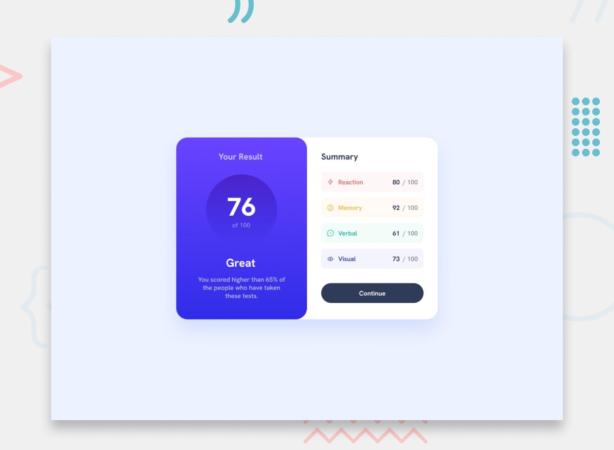

# Frontend Mentor - Results Summary Component

## Overview

This is my solution for the **Results Summary Component** challenge from Frontend Mentor.

I built this project using HTML and CSS, focusing on creating a responsive layout that matches the provided design as closely as possible.

Frontend Mentor challenges help developers improve their frontend skills by building realistic projects. :contentReference[oaicite:0]{index=0}

---

## Links

- Solution URL: https://www.frontendmentor.io/profile/yoz0816
- Repository URL: https://github.com/yoz0816/-Summary-Component

---

## Built With

- Semantic HTML5
- CSS3
- Flexbox
- Responsive Design

---

## Features

Users can:

- View the results summary component on desktop and mobile devices
- See a responsive layout based on screen size
- View different score categories with unique colors
- Interact with the Continue button hover state
- Experience a design close to the original Frontend Mentor challenge

---

## Screenshot

---

## What I Learned

During this project, I practiced:

- Building layouts with CSS Flexbox
- Creating reusable CSS classes
- Using CSS gradients
- Working with responsive design and media queries
- Matching a design using spacing, colors, and typography

---

## Development Process

1. Created the HTML structure using semantic elements.
2. Added the main layout using Flexbox.
3. Styled the result section with gradients and score circle.
4. Created reusable styles for summary items.
5. Added responsive behavior for smaller screens.
6. Adjusted spacing, colors, and typography to match the design.

## Author

Frontend Mentor:  
https://www.frontendmentor.io/profile/yoz0816

GitHub:  
https://github.com/yoz0816

---
