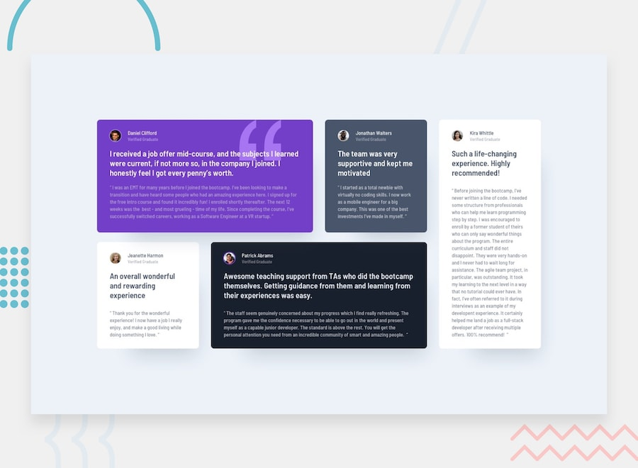

# Frontend Mentor - Testimonials Grid Section Solution

This is my solution to the **Testimonials Grid Section** challenge on Frontend Mentor. This project helped me practice building responsive layouts using CSS Grid while following a mobile-first workflow.

## Table of Contents

- [Frontend Mentor - Testimonials Grid Section Solution](#frontend-mentor---testimonials-grid-section-solution)
  - [Table of Contents](#table-of-contents)
  - [Overview](#overview)
    - [The Challenge](#the-challenge)
    - [Screenshot](#screenshot)
    - [Links](#links)
  - [My Process](#my-process)
    - [Built With](#built-with)
    - [What I Learned](#what-i-learned)
    - [Continued Development](#continued-development)
    - [Useful Resources](#useful-resources)
  - [Author](#author)

## Overview

### The Challenge

Users should be able to:

* View the optimal layout for the site depending on their device's screen size.

### Screenshot

### Link
* **Live Site URL:** https://yoz0816.github.io/Testimonials-Grid/

## My Process

### Built With

* Semantic HTML5
* CSS custom properties
* CSS Grid
* Flexbox
* Mobile-first workflow

### What I Learned

This project gave me more experience with CSS Grid and responsive layouts. I learned how to create complex grid structures while keeping the layout clean across different screen sizes.

I also practiced:

* Using CSS Grid to arrange testimonial cards.
* Combining Grid and Flexbox effectively.
* Creating reusable card styles.
* Improving responsive design with media queries.

### Continued Development

In future projects I want to continue improving:

* Advanced CSS Grid layouts
* Responsive design techniques
* Writing cleaner and more maintainable CSS
* Creating reusable CSS components

### Useful Resources

* Frontend Mentor
* MDN Web Docs
* CSS Tricks
* Kevin Powell's CSS tutorials

## Author

* **Name:** Jo Z
* **Frontend Mentor:** https://www.frontendmentor.io/profile/yoz0816
* **GitHub:** https://github.com/yoz0816
