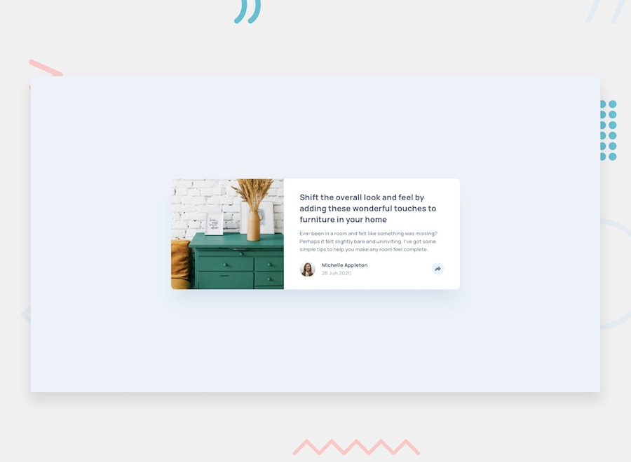

# Frontend Mentor - Article Preview Component Solution

This is my solution to the [Article preview component challenge](https://www.frontendmentor.io/challenges/article-preview-component-dYBN_pYFT) on Frontend Mentor. Frontend Mentor challenges help improve frontend development skills by building realistic projects.

## Table of contents

- [Frontend Mentor - Article Preview Component Solution](#frontend-mentor---article-preview-component-solution)
  - [Table of contents](#table-of-contents)
  - [Overview](#overview)
    - [The challenge](#the-challenge)
    - [Screenshot](#screenshot)
    - [Links](#links)
  - [My process](#my-process)
    - [Built with](#built-with)
    - [What I learned](#what-i-learned)
    - [Continued development](#continued-development)
    - [Useful resources](#useful-resources)
  - [Author](#author)

## Overview

### The challenge

Users should be able to:

* View the optimal layout for the component depending on their device's screen size
* See the social media share links when they click the share icon

### Screenshot

### Links

* Solution URL: Add your Frontend Mentor solution URL here
* Live Site URL: Add your live site URL here

## My process

### Built with

* Semantic HTML5 markup
* CSS
* Flexbox
* Responsive design
* CSS media queries
* JavaScript
* Google Fonts

### What I learned

This project helped me practice building a responsive component from a design and making it work on both desktop and mobile screens.

I practiced using **Flexbox** to create the layout and CSS media queries to change the design for smaller screens.

I also learned how to use JavaScript to show and hide an element when a button is clicked.

### Continued development

In future projects, I want to continue improving my:

* JavaScript DOM manipulation
* Responsive web design
* CSS positioning
* Flexbox layouts
* Writing cleaner and more maintainable CSS
* Building interactive components without relying on frameworks

### Useful resources

* [Frontend Mentor](https://www.frontendmentor.io/) - I used the challenge design and requirements to build the project.
* [MDN Web Docs](https://developer.mozilla.org/) - Useful reference for HTML, CSS, and JavaScript.
* [W3Schools](https://www.w3schools.com/) - Helpful for reviewing JavaScript and CSS concepts.

## Author

* Frontend Mentor - Add your Frontend Mentor profile URL here
* GitHub - Add your GitHub profile URL here
