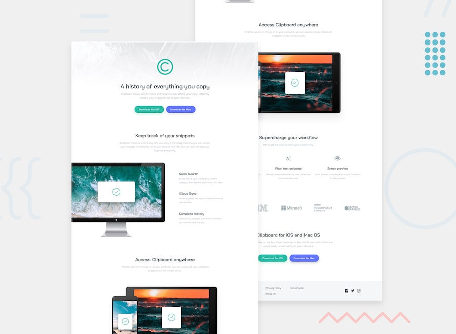

# Frontend Mentor - Clipboard Landing Page Solution

This is my solution to the [Clipboard Landing Page challenge](https://www.frontendmentor.io/challenges/clipboard-landing-page-5cc9bccd6c4c91111378ecb9) on Frontend Mentor. This challenge helped me improve my responsive web design skills by building a modern landing page using semantic HTML and CSS.

## Table of Contents

- [Frontend Mentor - Clipboard Landing Page Solution](#frontend-mentor---clipboard-landing-page-solution)
  - [Table of Contents](#table-of-contents)
  - [Overview](#overview)
    - [The Challenge](#the-challenge)
    - [Screenshot](#screenshot)
    - [Links](#links)
  - [My Process](#my-process)
    - [Built With](#built-with)
    - [What I Learned](#what-i-learned)
    - [Continued Development](#continued-development)
    - [Useful Resources](#useful-resources)
  - [Author](#author)

---

## Overview

### The Challenge

Users should be able to:

- View the optimal layout depending on their device's screen size.
- See hover states for all interactive elements.

### Screenshot

### Links

- **Solution URL:** https://github.com/yoz0816/clipboard-landing-page
- **Live Site URL:** https://yoz0816.github.io/clipboard-landing-page/

---

## My Process

### Built With

- Semantic HTML5
- CSS3
- CSS Custom Properties
- Flexbox
- CSS Grid
- Mobile-first workflow
- Responsive Design

---

### What I Learned

This project gave me more practice building responsive landing pages from a design file. I improved my understanding of Flexbox and CSS Grid by using them together to create layouts that adapt to different screen sizes.

I also became more comfortable using CSS custom properties to keep colors and spacing consistent throughout the project. Another valuable lesson was organizing HTML into meaningful semantic sections, making the code easier to read and maintain.

---

### Continued Development

In future projects, I want to continue improving:

- Writing cleaner and more maintainable CSS
- Building more responsive layouts
- Improving accessibility best practices
- Learning JavaScript for interactive web pages
- Building projects with React and Next.js

---

### Useful Resources

- **Frontend Mentor** – Great platform for practicing real-world frontend projects.
- **MDN Web Docs** – Excellent documentation for HTML and CSS.
- **CSS Tricks** – Helpful explanations of Flexbox, Grid, and other CSS techniques.
- **Google Fonts** – Used for the Bai Jamjuree font in this project.

---

## Author

- GitHub - https://github.com/yoz0816
- Frontend Mentor - https://www.frontendmentor.io/profile/yoz0816
