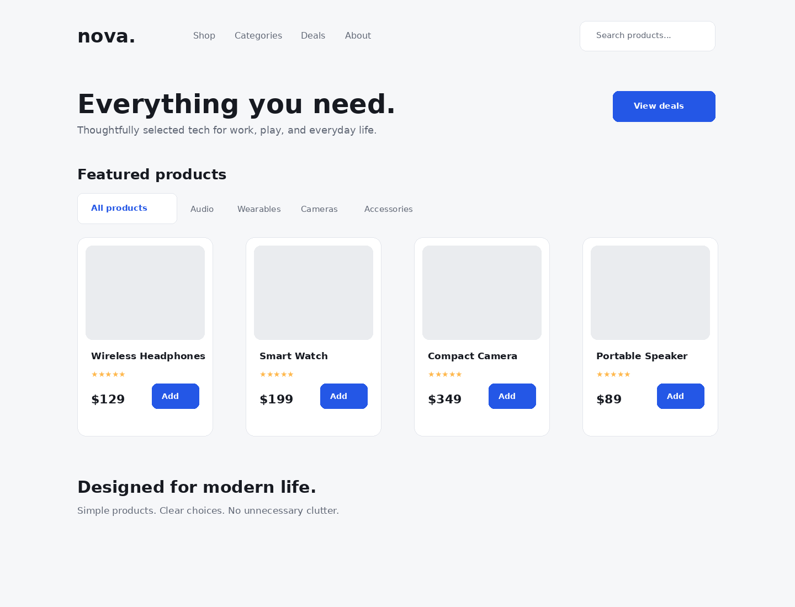

# Nova Shop - Responsive Product Listing Solution

This is my solution to the **Nova Shop** frontend practice challenge. This project helped me practice building a responsive product listing page using semantic HTML, CSS Grid, Flexbox, and responsive media queries while implementing interactive hover effects.

## Table of Contents

- [Nova Shop - Responsive Product Listing Solution](#nova-shop---responsive-product-listing-solution)
  - [Table of Contents](#table-of-contents)
  - [Overview](#overview)
    - [The Challenge](#the-challenge)
    - [Screenshot](#screenshot)
    - [Links](#links)
  - [My Process](#my-process)
    - [Built With](#built-with)
    - [What I Learned](#what-i-learned)
    - [Continued Development](#continued-development)
  - [Author](#author)

---

## Overview

### The Challenge

Users should be able to:

* View the optimal layout depending on their device's screen size.
* View a responsive product grid on desktop, tablet, and mobile devices.
* Navigate through the product categories.
* See hover states for interactive elements.
* View product information, ratings, prices, and buttons clearly.

### Screenshot

### Links

* **Solution URL:** [Solution URL](https://github.com/yoz0816/frontend-mentor-challenges/tree/main/nova-shop)

* **Live Site URL:**[Live URL](https://yoz0816.github.io/frontend-mentor-challenges/nova-shop/)

---

## My Process

### Built With

* Semantic HTML5
* CSS3
* CSS Grid
* Flexbox
* CSS Media Queries
* Responsive Web Design

### What I Learned

While building this project, I practiced:

* Creating responsive product layouts with CSS Grid.
* Using Flexbox for navigation and content alignment.
* Creating responsive layouts with media queries.
* Building reusable product cards.
* Using semantic HTML elements.
* Creating hover effects for interactive elements.
* Managing spacing, typography, and sizing across different screen sizes.
* Making product images and cards responsive.

### Continued Development

In future projects, I want to continue improving my:

* CSS Grid and Flexbox skills.
* Responsive design techniques.
* JavaScript DOM manipulation.
* Product filtering functionality.
* Search functionality.
* Shopping cart functionality.
* Accessibility.
* CSS animations and interactive effects.

---

## Author
* GitHub - https://github.com/yoz0816
* Frontend Mentor - https://www.frontendmentor.io/profile/yoz0816
