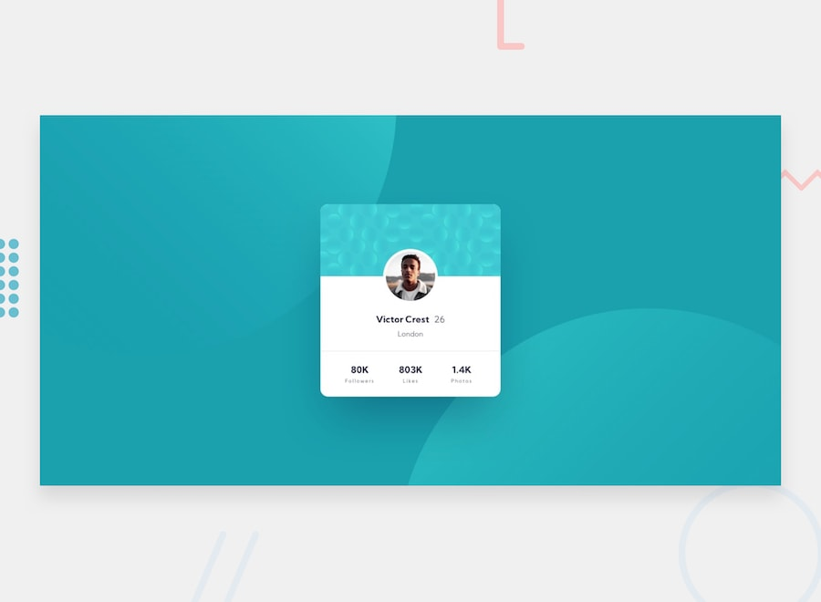

# Frontend Mentor - Profile Card Component Solution

This is my solution to the [Profile card component challenge](https://www.frontendmentor.io/challenges/profile-card-component-cfArpWshJ) on Frontend Mentor.

Frontend Mentor challenges help improve my frontend development skills by building realistic projects from provided designs.

## Table of contents

- [Frontend Mentor - Profile Card Component Solution](#frontend-mentor---profile-card-component-solution)
  - [Table of contents](#table-of-contents)
  - [Overview](#overview)
    - [The challenge](#the-challenge)
  - [Screenshot](#screenshot)
  - [Links](#links)
  - [My process](#my-process)
    - [Built with](#built-with)
    - [What I learned](#what-i-learned)
    - [Continued development](#continued-development)
    - [Useful resources](#useful-resources)
  - [Author](#author)

## Overview

### The challenge

Users should be able to:

* View the profile card component.
* See the profile information and statistics.
* View the layout correctly on both mobile and desktop screen sizes.
* Experience a responsive layout across different screen widths.

The designs were provided for:

* Mobile: 375px
* Desktop: 1440px

## Screenshot

## Links

* Solution URL: https://github.com/yoz0816/frontend-mentor-challenges/tree/main/profile-card-component-main
* Live Site URL: https://yoz0816.github.io/frontend-mentor-challenges/profile-card-component-main/

## My process

### Built with

* Semantic HTML5
* CSS3
* Flexbox
* Responsive design
* CSS background images
* CSS positioning
* Google Fonts
* Mobile-first responsive techniques

### What I learned

This project helped me practice creating a responsive profile card from a provided design.

One of the main things I learned was how to position an element so that it overlaps two different sections of a card.

### Continued development

In future projects, I want to continue improving:

* Responsive CSS
* CSS positioning
* Flexbox
* Background image positioning
* Mobile-first development
* Writing cleaner and more reusable CSS
* Matching designs more accurately

### Useful resources

* [Frontend Mentor](https://www.frontendmentor.io/) - Used the challenge design and requirements for this project.
* [MDN Web Docs](https://developer.mozilla.org/en-US/docs/Web/CSS) - Useful reference for CSS properties and responsive layouts.
* [Google Fonts](https://fonts.google.com/) - Used to add the Kumbh Sans font.

## Author

* Frontend Mentor - [@yoz0816](https://www.frontendmentor.io/profile/yoz0816)
* GitHub - [@yoz0816](https://github.com/yoz0816)
