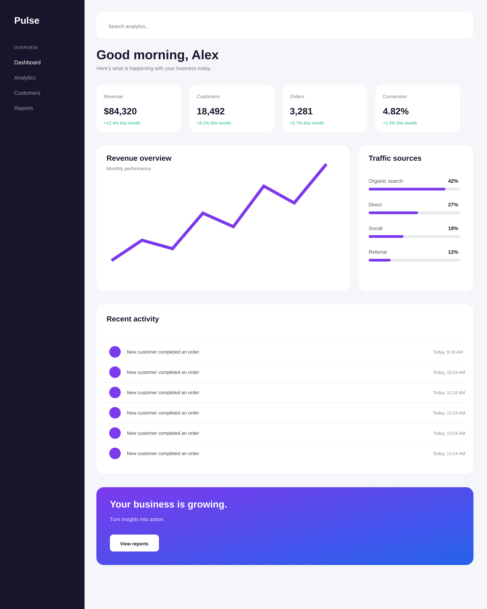

# Pulse Analytics

Pulse Analytics is a responsive business analytics dashboard built to practice modern HTML and CSS layout techniques.

The dashboard presents business information such as revenue, customers, orders, conversion rates, traffic sources, recent activity, and business reports in a clean and responsive interface.

## Table of contents

- [Pulse Analytics](#pulse-analytics)
  - [Table of contents](#table-of-contents)
  - [Overview](#overview)
    - [The project](#the-project)
  - [Screenshot](#screenshot)
  - [Links](#links)
  - [My process](#my-process)
    - [Built with](#built-with)
    - [What I learned](#what-i-learned)
    - [Continued development](#continued-development)
    - [Useful resources](#useful-resources)
  - [Author](#author)

## Overview

### The project

The goal of this project was to build a business analytics dashboard with a responsive layout.

The dashboard includes:

* Sidebar navigation
* Search bar
* Business overview section
* Revenue statistics
* Customer statistics
* Order statistics
* Conversion statistics
* Revenue overview chart
* Traffic sources
* Recent activity
* Business growth section
* Responsive layouts for desktop, tablet, and mobile screens

## Screenshot

## Links

* Solution URL: [GitHub Repository](https://github.com/yoz0816/frontend-mentor-challenges/tree/main/pulse-analytics)
* Live Site URL: [Live Demo](https://yoz0816.github.io/frontend-mentor-challenges/pulse-analytics/)

## My process

### Built with

* Semantic HTML5
* CSS3
* Flexbox
* CSS Grid
* Responsive design
* CSS media queries
* CSS positioning
* CSS background and image handling
* Google Fonts
* Mobile-first responsive techniques

### What I learned

This project helped me improve my ability to create a complete dashboard layout using HTML and CSS.

I practiced combining **Flexbox and CSS Grid** to create different sections of the dashboard and learned how to make fixed layouts more responsive.

### Continued development

In future projects, I want to continue improving:

* Responsive web design
* CSS Grid and Flexbox
* Advanced CSS layouts
* JavaScript DOM manipulation
* Interactive dashboard components
* Form and input handling
* Accessibility
* Writing cleaner and more reusable CSS
* Creating more accurate designs from references

### Useful resources

* [MDN Web Docs](https://developer.mozilla.org/en-US/docs/Web/CSS) - Used as a reference for CSS properties, Flexbox, Grid, and responsive layouts.
* [Google Fonts](https://fonts.google.com/) - Used to add the DM Sans font.
* [Frontend Mentor](https://www.frontendmentor.io/) - Used for frontend practice and improving design implementation skills.

## Author

* Frontend Mentor - [@yoz0816](https://www.frontendmentor.io/profile/yoz0816)
* GitHub - [@yoz0816](https://github.com/yoz0816)
