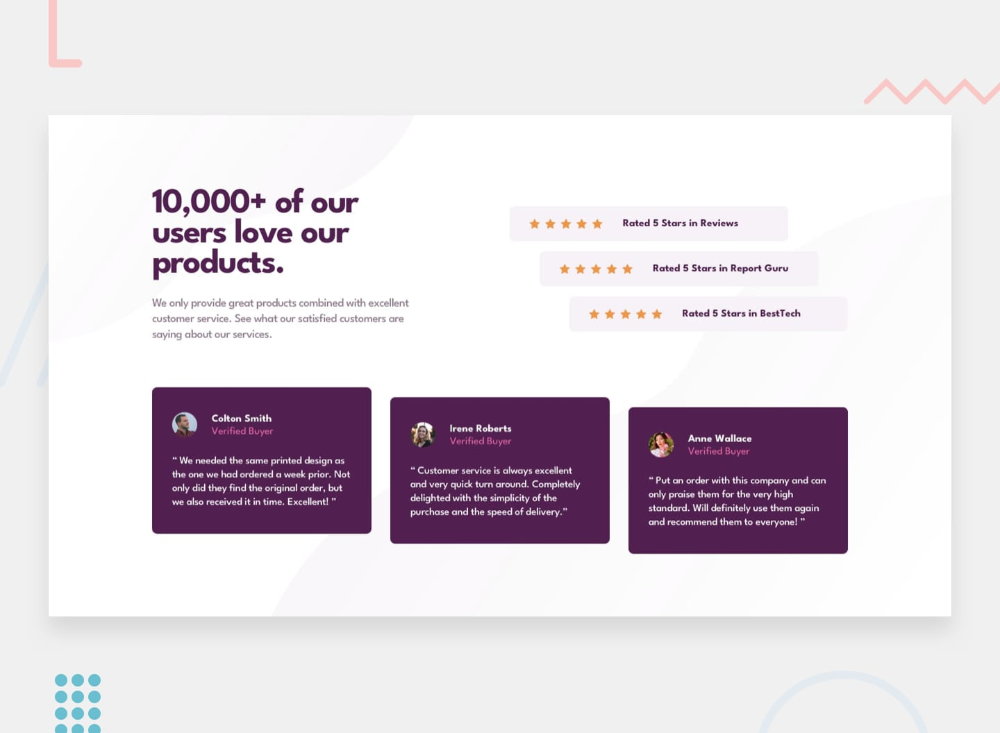

# Frontend Mentor - Social proof section solution

This is a solution to the [Social proof section challenge](https://www.frontendmentor.io/challenges/social-proof-section-6e0qTv_bA) from Frontend Mentor.

Frontend Mentor challenges help improve front-end development skills by building realistic projects.

## Table of contents

- [Frontend Mentor - Social proof section solution](#frontend-mentor---social-proof-section-solution)
  - [Table of contents](#table-of-contents)
  - [Overview](#overview)
    - [The challenge](#the-challenge)
    - [Screenshot](#screenshot)
    - [Links](#links)
- [My process](#my-process)
  - [Built with](#built-with)
  - [What I learned](#what-i-learned)
  - [Continued development](#continued-development)
  - [Useful resources](#useful-resources)
  - [Author](#author)

---

## Overview

### The challenge

Users should be able to:

- View the optimal layout for the section depending on their device's screen size
- See responsive layouts for desktop and mobile screens
- Experience accurate typography, spacing, colors, and card positioning

---

### Screenshot

---

### Links

- Live Site URL: https://yoz0816.github.io/social-proof/

---

# My process

## Built with

- Semantic HTML5 markup
- CSS custom properties
- Flexbox
- Responsive design
- Mobile-first workflow
- CSS media queries
- Google Fonts
- Git and GitHub

---
## What I learned

During this project, I improved my understanding of:

- Creating responsive layouts using Flexbox
- Positioning elements with spacing and alignment
- Building reusable CSS structures
- Working with custom fonts from Google Fonts
- Creating staggered layouts using CSS transforms
- Improving accessibility with semantic HTML
- --
## Continued development

In future projects, I want to continue improving:

- Advanced CSS layouts using Grid and Flexbox
- Better accessibility practices
- Writing cleaner and more reusable CSS
- Building larger projects with JavaScript and React
- Improving responsive design skills

---

## Useful resources

- [Frontend Mentor](https://www.frontendmentor.io/) - Great platform for practicing real-world frontend challenges.
- [MDN Web Docs](https://developer.mozilla.org/) - Helpful documentation for HTML and CSS.

---

## Author
- Frontend Mentor - [@yoz0816](https://www.frontendmentor.io/profile/yoz0816)
- GitHub - [@yoz0816](https://github.com/yoz0816)
